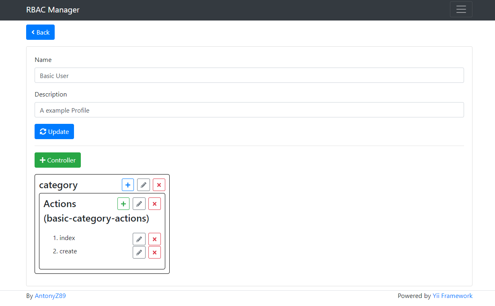
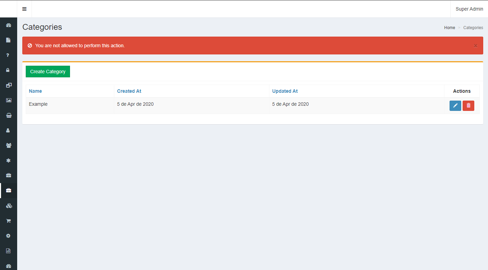
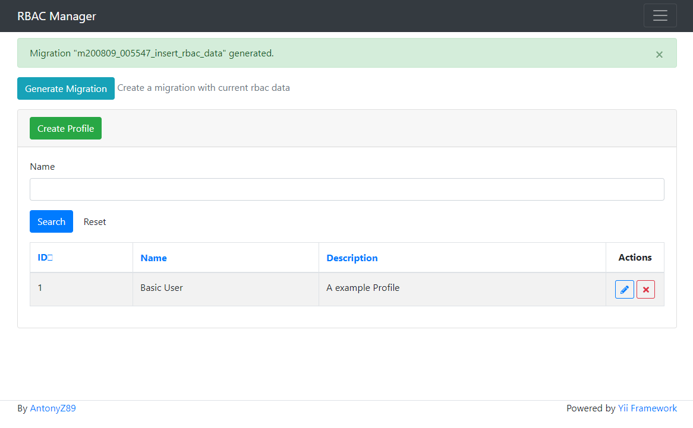
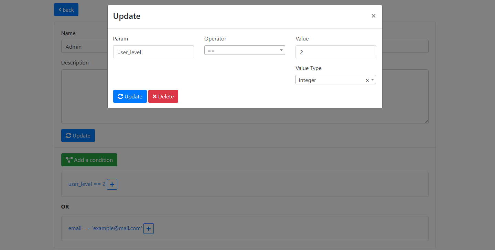
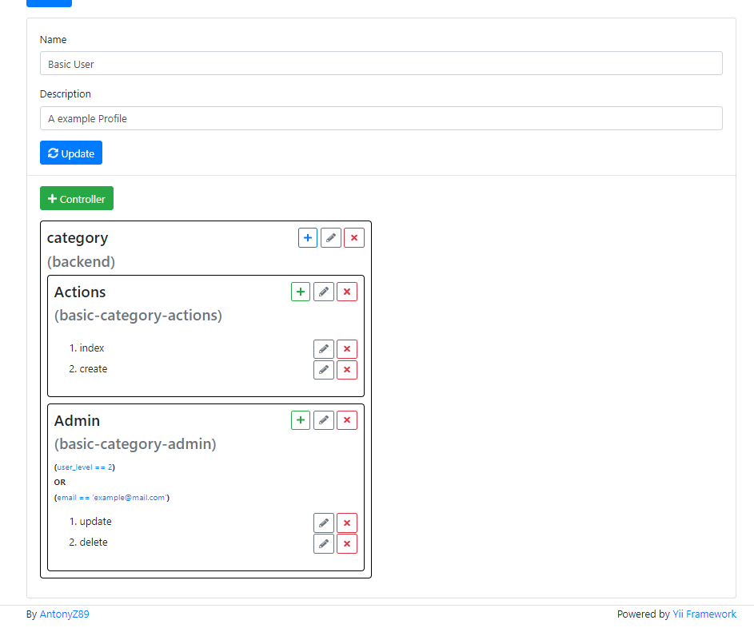

yii2-rbac
============

<a href="https://www.paypal.com/cgi-bin/webscr?cmd=_s-xclick&hosted_button_id=YATHVT293SXDL&source=url">
  
</a>

Installation
------------

The preferred way to install this extension is through [composer](http://getcomposer.org/download/).

Either run

```
$ composer require antonyz89/yii2-rbac dev-master
```

or add

```
"antonyz89/yii2-rbac": "dev-master"
```

to the require section of your `composer.json` file.

Usage
-----

```
$ php yii migrate/up --migrationPath=@antonyz89/rbac/migrations
```

Add bootstrap and module in to main.php

```php
return [
    'bootstrap' => ['rbac'],
    'modules' => [
        'rbac' => ['class' => 'antonyz89\rbac\Module'],
    ],
]
```

---

# Applying Rules

1 - Add AccessControl to your Controller's Behaviour

```php
use antonyz89\rbac\components\AccessControl;

/**
 * ExampleController implements the CRUD actions for Example model.
 */
class ExampleController extends Controller
{
    /**
     * {@inheritdoc}
     */
    public function behaviors()
    {
        return [
            'access' => [
                'class' => AccessControl::class, /* add */
                /* optional fields */
                'rules' => [
                    [
                        'actions' => [
                            'create',
                            'update',
                            'view',
                            'index',
                        ],
                        'allow' => true,
                        'roles' => ['@'],
                    ],
                ],
            ],
            'verbs' => [
                'class' => VerbFilter::class,
                'actions' => [
                    'delete' => ['POST'],
                ],
            ],
        ];
    }
}
````

2 - Create a rbac_profile_id to your identity class

`php yii migrate/create add_rbac_profile_id_to_user_table`

```php
<?php

use yii\db\Migration;

/**
 * Class m200808_033148_add_rbac_profile_id_to_user_table
 */
class m200808_033148_add_rbac_profile_id_to_user_table extends Migration
{
    /**
     * {@inheritdoc}
     */
    public function safeUp()
    {
        $this->addColumn('{{%user}}', 'rbac_profile_id', $this->integer()->notNull()->after('id'));
        $this->createIndex('idx-user-rbac_profile_id', '{{%user}}', 'rbac_profile_id');
        $this->addForeignKey('fk-user-rbac_profile_id', '{{%user}}', 'rbac_profile_id', '{{%rbac_profile}}', 'id', 'CASCADE', 'CASCADE');
    }

    /**
     * {@inheritdoc}
     */
    public function safeDown()
    {
        $this->dropForeignKey('fk-user-rbac_profile_id', '{{%user}}');
        $this->dropIndex('idx-user-rbac_profile_id', '{{%user}}');
        $this->dropColumn('{{%user}}', 'rbac_profile_id');
    }
}
```

3 - use `php yii migrate`

3.1 - Now, include it on `_form.php` and `Class` of your identity.

3.2 - Add `getRbacProfile()`

```php
    /**
     * @return \yii\db\ActiveQuery|\antonyz89\rbac\models\query\RbacProfileQuery
     */
    public function getRbacProfile()
    {
        return $this->hasOne(RbacProfile::class, ['id' => 'rbac_profile_id']);
    }
```

4 - Access `http://localhost/rbac` or `http://localhost?r=rbac` and create a Profile with Controllers and Actions that 
you want whoever has this Profile to be able to access these Controllers and Actions



5 - When your Identity tries to access an existing Controller/Action in his Profile nothing will happen, 
but if you try to access a Controller/Action that does not exist in his Profile, an error will appear:

`Error at access http://localhost/category/update?id=16`


--

If you use AdminLTE, you can use my modified menu widget that works with RBAC and hides/displays menus according 
to the controllers/actions contained in the logged Identity's Profile, in addition to supporting roles like "@" and "?"

```php

<?php

use antonyz89\rbac\widgets\Menu;

?>

<?php echo Menu::widget(
    [
        'options' => ['class' => 'sidebar-menu tree', 'data-widget' => 'tree'],
        'items' => [
            [
                'label' => 'Dashboard',
                'icon' => 'dashboard',
                'url' => ['site/index'],
                'role' => ['@'],
            ],
            /* A button can disappear if Identity's Profile don't have this Controller and Action */
            [
                'label' => 'Administrators',
                'icon' => 'lock',
                'url' => ['admin/index'],
                'role' => ['@']
            ]
        ]
    ]
); ?>
```

### You can generate a migration with your current data of RBAC clicking on 'Generate Migration' button:

`You can find the migration at 'console/migrations'` and run using `php yii migrate`



---

# Conditional Blocks

You can create blocks for each controller added to the profile. 
Each block can contain a specific condition to allow access to the user to that controller and yours actions.



In this case, all users with `user_level = 2`  or `email = 'example@mail.com'`  can access this block.



